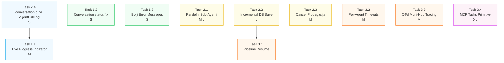

# agent-studio — Plan Unapređenja 2026

> **Verzija:** 1.0
> **Datum:** 2026-04-01
> **Autori:** buky + Claude Sonnet 4.6
> **Status:** Aktivno planiranje
> **Kontekst:** Nastao nakon dijagnostike i popravke SDLC Pipeline Orchestratora (commits `4a220dc`, `324b52e`)

---

## 1. Executive Summary

Tokom dvije debug sesije identificirane su dvije kritične greške u multi-agent orchestration sistemu i uspješno popravljene. Ovaj plan dokumentuje sve naučene lekcije i pretvara ih u strukturirani roadmap unapređenja za sljedećih 8-12 sedmica.

**Popravljeno (već u produkciji):**
- `executeFlow(subContext, input.message)` — sub-agenti sada dobijaju stvarni zadatak
- `writer.write()` wrapped u try/catch — rezultati se čuvaju u DB čak i kad klijent diskoneektuje
- Klijentski timeout `180s → 1800s` — streaming konekcija ostaje živa tokom dugih pipeline-ova

**Preostaje:** Vidljivost, performanse i resilience sistema pri dugim multi-agent izvršavanjima.

---

## 2. Kontekst — Šta Smo Naučili

### 2.1 Dijagnostičke Lekcije

| Greška | Uzrok | Trajanje Debug | Impakt |
|--------|-------|----------------|--------|
| Sub-agenti ignorišu zadatak | `executeFlow(subContext)` bez 2. argumenta | ~3h | Cijeli Orchestrator neupotrebljiv |
| Rezultati izgubljeni pri disconnect | `allMessages.push()` dolazi NAKON `writer.write()` koji baca | ~2h | Korisnik ne dobija odgovor |
| 180s timeout ubija pipeline | `AbortController` na klijentu | ~1h | Pipeline od 15 min nikad ne završi |

### 2.2 Arhitekturalne Lekcije

- **Sekvencijalni sub-agenti su spori**: 10-15 agenata × 30-100s = 5-15 minuta. Mora biti paralela.
- **Streaming je krhak**: Svaki `writer.write()` koji nije zaštićen može prekinuti akumulaciju poruka u `allMessages`.
- **Nema vidljivosti za korisnika**: 15 minuta "thinking..." bez ikakvog feedbacka je neprihvatljivo UX.
- **Conversation status ne prati stvarnost**: Ostaje `ACTIVE` zauvek čak i kad je pipeline završen.

---

## 3. Usklađenost sa 2026 Standardima

### 3.1 MCP 2025-11-05 (Model Context Protocol)

| Zahtjev Specifikacije | Trenutni Status | Gap | Prioritet |
|-----------------------|-----------------|-----|-----------|
| Streamable HTTP transport | ✅ Implementirano | — | — |
| MCP Roots (workspace URIs) | ✅ Implementirano | — | — |
| MCP Resources (`kb://` URIs) | ✅ Implementirano | — | — |
| **Tasks primitive** (long-running + progress) | ⚠️ Djelimično | Nema granularnog progress trackinga po tasku | **Srednji** |
| **Elicitation** (server traži input u toku taska) | ❌ Nedostaje | Human-approval postoji, ali ne po MCP spec | **Niski** |
| Resource Subscriptions (streaming resource updates) | ❌ Nedostaje | — | **Niski** |

**Kritičan gap:** Tasks primitive — MCP spec zahtijeva da dugi taskovi imaju `progress` notifikacije. Naš sistem to nema za sub-agent calls. Ovo se direktno poklapa sa "Incremental DB save" stavkom u planu.

### 3.2 Google A2A v0.3

| Zahtjev Specifikacije | Trenutni Status | Gap | Prioritet |
|-----------------------|-----------------|-----|-----------|
| Agent Card (JSON-LD) | ✅ Implementirano (`/api/agents/[id]/card.json`) | — | — |
| Agent Discovery endpoint | ✅ Implementirano (`/api/a2a/agents`) | — | — |
| Task submission + polling | ✅ Implementirano | — | — |
| **Streaming task updates** (SSE po tasku) | ⚠️ Djelimično | Stream je globalan, ne per-task | **Srednji** |
| Task cancellation | ⚠️ Djelimično | `aborted` flag postoji, ne propagira do sub-agenata | **Visoki** |
| Agent capability negotiation | ❌ Nedostaje | Nema dinamičke pregovoranje sposobnosti | **Niski** |

**Kritičan gap:** Task cancellation — ako korisnik cancelluje chat, sub-agenti nastavljaju trošiti tokene i compute. Direktno se uklapa u "Cancel propagation" stavku.

### 3.3 OpenTelemetry gen_ai.* (AAIF 2026)

| Atribut / Konvencija | Trenutni Status | Gap |
|----------------------|-----------------|-----|
| `gen_ai.system` | ✅ | — |
| `gen_ai.request.model` | ✅ | — |
| `gen_ai.usage.input_tokens` / `output_tokens` | ✅ | — |
| `gen_ai.operation.name` | ❌ | Nema `"execute_tool_call"` operacija |
| **Multi-hop agent tracing** (traceId propagacija između sub-agenata) | ⚠️ Djelimično | `traceId` u DB ali ne propagira do nested spans |
| `gen_ai.agent.id` / `gen_ai.agent.name` | ❌ | AAIF 2026 zahtijeva agent identifikaciju u svakom spanu |

---

## 4. Plan Unapređenja

### Legenda Effort-a

| Oznaka | Procjena | Opis |
|--------|----------|------|
| **S** | 0.5–1 dan | Jedna komponenta, jasna promjena |
| **M** | 2–3 dana | Više fajlova, može zahtijevati migraciju |
| **L** | 4–5 dana | Nova feature, backend + frontend |
| **XL** | 2+ sedmice | Arhitekturalna promjena |

---

### Faza 1 — Vidljivost (Sedmica 1–2)

> **Cilj:** Korisnik uvijek zna šta se dešava tokom pipeline-a.

#### Task 1.1 — Live Pipeline Progress Indikator

**Opis:** Polling `agent-calls` API-a svakih 5 sekundi u chat UI-u i prikaz realnog progresa dok pipeline teče.

```
Architecture Decision ✅ (55s)
Security Engineer     ✅ (30s)
TDD Guide             ⏳ (u toku...)
Code Generation       ⏱ čeka...
```

**Fajlovi:**
- `src/app/chat/[agentId]/page.tsx` — dodati `PipelineProgress` komponentu
- Nova: `src/components/chat/pipeline-progress.tsx` — SWR polling + vizuelni prikaz
- `src/app/api/agent-calls/route.ts` — dodati filter po `conversationId`

**Effort:** M (2-3 dana)

**Rizici:**
- `agent-calls` nema `conversationId` kolonu → potreban DB index ili join kroz tracing
- Prebrz polling može opteretiti DB → koristiti Redis cache sa 3s TTL

**Mitigacija:** Dodati `conversationId` na `AgentCallLog` model (nova migracija, non-breaking).

**Success Metrics:**
- ✅ Korisnik vidi status svakog sub-agenta u realnom vremenu
- ✅ Nema degradacije DB performansi (query < 50ms)

---

#### Task 1.2 — Conversation.status Automatski Update

**Opis:** `Conversation.status` ostaje `ACTIVE` zauvek. Trebalo bi postati `COMPLETED` kada engine završi i `ABANDONED` kada se timeout dogodi.

**Fajlovi:**
- `src/lib/runtime/context.ts` → `saveContext()` — dodati status update na kraju
- `src/lib/runtime/engine-streaming.ts` — `finally` blok treba označiti kao COMPLETED
- `src/lib/runtime/engine.ts` — isto

**Effort:** S (0.5 dana)

**Rizici:** Minimalni — samo dodatni Prisma update u existing `saveContext`.

**Success Metrics:**
- ✅ 100% konverzacija ima tačan status u DB
- ✅ Analytics dashboard prikazuje realnu distribuciju COMPLETED/ABANDONED

---

#### Task 1.3 — Bolji Error Messages pri Pipeline Greški

**Opis:** Trenutna poruka "Something went wrong. Let me try to continue." je previše generička. Treba prikazati koji sub-agent je pao i zašto.

**Fajlovi:**
- `src/lib/runtime/engine-streaming.ts` — catch blokovi
- `src/lib/agents/agent-tools.ts` — `executeSubAgentInternal` error handling

**Effort:** S (1 dan)

**Rizici:** Opasnost od curenja internih detalja u production. Koristiti `sanitizeErrorMessage()` koji već postoji.

**Success Metrics:**
- ✅ Error message sadrži ime failed agenta i tip greške
- ✅ Nema curenja stack trace-a u produkciji

---

### Faza 2 — Performanse (Sedmica 3–6)

> **Cilj:** Pipeline od 15 minuta svesti na 5-6 minuta. Nikad ne gubiti rezultate.

#### Task 2.1 — Paralelno Izvršavanje Sub-Agenata

**Opis:** Orchestrator trenutno poziva agente sekvencijalno. Mnogi su nezavisni i mogu raditi simultano.

**Predložena paralelizacija SDLC pipeline-a:**
```
START
  ├──► Architecture Decision Agent ──┐
  │                                   ├──► TDD Guide ──► Code Generation ──► Code Review + Security (parallel)
  └──► [odmah] Security Engineer ────┘
                                       ├──► Doc Updater ─┐
                                       └──► CI/CD Gen ───┴──► Deploy Decision ──► END
```

**Opcija A (Brža implementacija):** Modificirati Orchestrator system prompt da koristi `parallel` node pattern i poziva više agenata simultano u jednom `streamText` pozivu.

**Opcija B (Ispravnija):** Koristiti `parallel` node tip koji već postoji u engine-u i prepisati Orchestrator flow u Flow Builder-u.

**Preporučeno:** Opcija A kratkoročno (promjena samo system prompta), Opcija B kao follow-up.

**Effort:** M za Opciju A, L za Opciju B

**Rizici:**
- Paralelni pozivi troše više tokena *simultano* → moguće rate limiting kod providera
- Rezultati iz paralelnih poziva moraju biti aggregirani u smislenu cjelinu
- `parallel` handler u engine-u treba testirati sa 5+ simultanih agent-as-tool poziva

**Mitigacija:** Koristiti `cost_monitor` node sa `mode: "adaptive"` da automatski throttluje pri visokom trošenju.

**Success Metrics:**
- ✅ Ukupno trajanje pipeline-a < 6 minuta (sa trenutnih ~15 min)
- ✅ Nema povećanja error rate-a u paralelnom modu
- ✅ Token trošak po pipeline-u ne raste više od 20%

---

#### Task 2.2 — Incremental DB Save po Sub-Agentu

**Opis:** Trenutno se svi rezultati čuvaju tek na kraju (`finally` blok). Ako server crashuje na 14/15 agenata — sve je izgubljeno. Svaki completed sub-agent call trebao bi odmah upisati intermediate rezultat.

**Implementacija:**
1. Dodati `partialResults Json?` kolonu na `Conversation` model
2. U `agent-tools.ts`, nakon svakog `executeSubAgentInternal` poziva, upisati rezultat u `partialResults`
3. `loadContext()` pri resume-u treba učitati `partialResults` i preskočiti completed agente

**Fajlovi:**
- `prisma/schema.prisma` — nova kolona `Conversation.partialResults`
- `src/lib/agents/agent-tools.ts` — fire-and-forget save after each tool call
- `src/lib/runtime/context.ts` — `loadContext()` hydration

**Effort:** L (4-5 dana)

**Rizici:**
- Česte Prisma update operacije mogu biti spore → koristiti `updateMany` batching ili Redis buffer
- Schema migracija je breaking change za existing conversations

**Mitigacija:** `partialResults` je optional polje, backward compatible. Koristiti Redis (koji već postoji) kao privremeni buffer.

**Success Metrics:**
- ✅ Crash recovery: korisnik može nastaviti pipeline od zadnjeg sačuvanog koraka
- ✅ Nema degradacije performansi (< 10ms overhead po sub-agentu)

---

#### Task 2.3 — Cancel Propagacija do Sub-Agenata

**Opis:** Kada korisnik zatvori browser, `aborted = true` se postavlja ali sub-agenti nastavljaju da se izvršavaju i troše tokene. Treba propagirati cancel signal.

**Implementacija:**
- `engine-streaming.ts`: dodati `signal: streamAbortController.signal` u `streamOptions` za `streamText`
- `agent-tools.ts`: proslijediti `AbortSignal` do `executeSubAgentInternal` i na `executeFlow`

**Fajlovi:**
- `src/lib/runtime/engine-streaming.ts`
- `src/lib/agents/agent-tools.ts`
- `src/lib/runtime/engine.ts` — `executeFlow` treba primiti opcioni `AbortSignal`

**Effort:** M (2-3 dana)

**Rizici:**
- `executeFlow` je sync flow — AbortSignal treba provjeru na svakom node iteration
- Potrebno testirati da cancel ne ostavlja DB u inconsistent stanju

**Success Metrics:**
- ✅ Nakon browser close, svi sub-agenti zaustavljaju se u < 5 sekundi
- ✅ Token trošak se smanjuje za ~80% pri ranom cancel-u
- ✅ A2A v0.3 compliance: Task cancellation radi po spec-u

---

#### Task 2.4 — `conversationId` na `AgentCallLog`

**Opis:** Prerequisit za Task 1.1. Dodati `conversationId` na `AgentCallLog` model kako bi progress indikator mogao filtrirati calls po aktivnoj konverzaciji.

**Fajlovi:**
- `prisma/schema.prisma` — nova kolona + index
- `src/lib/agents/agent-tools.ts` — proslijediti `conversationId` pri kreiranju log zapisa

**Effort:** S (0.5 dana)

**Rizici:** Non-breaking schema promjena. Stari zapisi će imati `null` za `conversationId`.

**Success Metrics:**
- ✅ Query `AgentCallLog WHERE conversationId = X` vraća rezultate < 10ms

---

### Faza 3 — Resilience (Sedmica 7–12)

> **Cilj:** Sistem koji se oporavlja sam, radi dugo bez intervencije i poštuje 2026 standarde.

#### Task 3.1 — Pipeline Resume (Nastavi od Zadnjeg Koraka)

**Opis:** Korisnik koji izgubi konekciju (ili čiji browser crashuje) trebao bi moći kliknuti "Nastavi" i dobiti nastavak izvršavanja od tačke gdje je stalo.

**Prerequisiti:** Task 2.2 mora biti završen (Incremental DB Save).

**Implementacija:**
1. Nova API ruta: `POST /api/agents/[agentId]/conversations/[conversationId]/resume`
2. "Nastavi" dugme u chat UI-u za konverzacije sa status `ACTIVE` i `partialResults` koji nisu prazni
3. `loadContext()` treba prepoznati resume mode i učitati `partialResults` kao početni state

**Inspiracija:** CLI Generator resume endpoint (`/api/cli-generator/[id]/resume`) koji već postoji.

**Effort:** L (5 dana)

**Rizici:**
- Treba paziti na double-execution — konverzacija koja se resumea ne smije pokrenuti dupli pipeline
- Idempotency key potreban za resume API

**Success Metrics:**
- ✅ Uspješan resume u > 95% slučajeva gdje su `partialResults` prisutni
- ✅ Dupli pipeline nikad ne nastaje (idempotency garantovana)

---

#### Task 3.2 — Per-Agent Timeout Profili

**Opis:** `DEFAULT_TIMEOUT_SECONDS = 120` je flat za sve agente. Code Generation treba 90-120s, Reality Checker samo 25s, Architecture Decision ~55s. Prekoračenja bi trebala biti adaptivna.

**Implementacija:**
- Nova konfiguracija u `agent-tools.ts`: `AGENT_TIMEOUT_PROFILES` mapa po `agentId` tipu
- Fallback na `DEFAULT_TIMEOUT_SECONDS` ako profil nije definisan
- UI u Agent Builder-u: "Expected duration" slider u agent settings

**Effort:** M (2-3 dana)

**Rizici:** Kraći timeout može prekinuti legitimne dugačke analize. Treba conservative defaults.

**Success Metrics:**
- ✅ Nema timeout-a za agente koji su poznati po dugom izvršavanju
- ✅ Brzi agenti (Reality Checker) imaju kraći timeout, greška se detektuje brže

---

#### Task 3.3 — OpenTelemetry Multi-Hop Tracing

**Opis:** Kompletirati AAIF 2026 compliance — dodati `gen_ai.operation.name`, `gen_ai.agent.id`, `gen_ai.agent.name` atribute i propagirati `traceId` kroz cijeli multi-agent chain.

**Implementacija:**
- `src/lib/observability/tracer.ts` — dodati missing AAIF 2026 atribute
- `src/lib/agents/agent-tools.ts` — propagirati `traceId` u sub-agent context
- `src/lib/runtime/engine.ts` — kreirati child span za svaki node execution

**Effort:** M (2-3 dana)

**Success Metrics:**
- ✅ Grafana prikazuje kompletan multi-hop trace od Orchestratora do leaf agenta
- ✅ `gen_ai.agent.id` i `gen_ai.agent.name` prisutni u svakom spanu
- ✅ Latency po agentu vidljiva u Grafana dashboard-u

---

#### Task 3.4 — MCP Tasks Primitive

**Opis:** MCP 2025-11-05 uvodi `Tasks` primitive za long-running operacije sa progress notifikacijama. Naši sub-agent calls su idealni kandidati — trebaju reportovati progress ka MCP klijentu.

**Implementacija:**
- Svaki sub-agent call kreirati kao MCP Task sa `{ taskId, status: "running", progress: n/N }`
- Progress update pri svakom completed sub-agentu
- MCP klijent (ako postoji) prima stream updates

**Effort:** XL (2+ sedmice) — zahtijeva MCP client upgrade i protokol implementaciju

**Success Metrics:**
- ✅ MCP Tasks spec 100% usklađen
- ✅ Eksterni MCP klijenti (Claude Desktop, itd.) vide progress dugih pipeline-ova

---

## 5. Dependency Mapa



**ASCII fallback (bez Mermaid renderinga):**

```
Sedmica 1-2 (Faza 1):
  [S] 2.4 conversationId ──────────────► [M] 1.1 Live Progress
  [S] 1.2 Conversation status              (nezavisno)
  [S] 1.3 Error messages                   (nezavisno)

Sedmica 3-6 (Faza 2):
  [M] 2.1 Paralelni agenti                (nezavisno, visok ROI)
  [L] 2.2 Incremental save ───────────► [L] 3.1 Pipeline Resume (Faza 3)
  [M] 2.3 Cancel propagacija              (nezavisno)

Sedmica 7-12 (Faza 3):
  Prereq 2.2 → [L] 3.1 Resume
               [M] 3.2 Timeout profili     (nezavisno)
               [M] 3.3 OTel tracing        (nezavisno)
               [XL] 3.4 MCP Tasks          (blokiran na spec implementaciji)
```

---

## 6. Risk Register

| ID | Rizik | Vjerovatnoća | Impakt | Mitigacija |
|----|-------|-------------|--------|------------|
| R1 | Paralelni sub-agenti (2.1) izazivaju rate limiting kod DeepSeek/OpenAI | Visoka | Visok | Staggered starts (200ms delay između poziva), `cost_monitor` adaptive mode |
| R2 | Incremental save (2.2) degradira DB performanse | Srednja | Srednji | Redis buffer, batch write svakih 30s umjesto po agentu |
| R3 | Cancel propagacija (2.3) ostavlja DB u inconsistent stanju | Niska | Visok | Transakcijski cancel sa rollback, idempotency check |
| R4 | Live progress polling (1.1) bombarduje `/api/agent-calls` endpoint | Srednja | Nizak | 5s polling interval, Redis cache sa 3s TTL |
| R5 | MCP Tasks (3.4) zahtijeva breaking change u MCP klijentima | Visoka | Srednji | Feature flag, backwards-compatible rollout |
| R6 | Schema migracije (2.2, 2.4) blokiraju Railway deploy | Niska | Visok | Test na staging branchu, Railway `pnpm db:migrate` pre deploy-a |

---

## 7. Success Metrics Dashboard

### KPIs koji Mjerimo

| Metrika | Trenutno | Target Faza 1 | Target Faza 2 | Target Faza 3 |
|---------|---------|---------------|---------------|---------------|
| Pipeline duration (15 agenata) | ~15 min | ~15 min | **~5 min** | ~5 min |
| % pipeline-ova sa sačuvanim rezultatom | ~60%* | ~60%* | **>99%** | >99% |
| Korisnik vidi progress tokom pipeline-a | ❌ 0% | **✅ 100%** | 100% | 100% |
| Conversation.status tačnost | ~40% | **>99%** | >99% | >99% |
| Sub-agent cancel (< 5s) | ❌ Nikad | ❌ | **✅** | ✅ |
| Pipeline resume uspješnost | N/A | N/A | N/A | **>95%** |
| OTel tracing completeness | 60% | 60% | 60% | **100%** |
| MCP Tasks compliance | 0% | 0% | 0% | **100%** |

*\*60% jer kratki pipelines (< 180s) uvijek uspiju, dugi često ne*

### Kako Mjeriti

- **Pipeline duration:** `AgentCallLog` timestamps od prvog do zadnjeg call-a
- **Sačuvani rezultati:** `Conversation` gdje `messageCount > 1` / ukupno sa sub-agent calls
- **Progress vidljivost:** Nova `AnalyticsEvent` tipa `PIPELINE_PROGRESS_VIEWED`
- **Cancel time:** `AgentCallLog` — razlika između cancel signala i zadnjeg `COMPLETED` zapisa

---

## 8. Preporučeni Redoslijed Implementacije

```
Sedmica 1
  Dan 1:    Task 1.2 (Conversation.status) — S, visok ROI, 0 rizika
  Dan 1-2:  Task 2.4 (conversationId na AgentCallLog) — S, prerequisit za 1.1
  Dan 2-5:  Task 1.1 (Live Progress Indikator) — M, najveći UX impact

Sedmica 2
  Dan 1:    Task 1.3 (Bolji Error Messages) — S, quick win
  Dan 2-4:  Task 2.3 (Cancel Propagacija) — M, token savings + A2A compliance
  Dan 5:    Deploy, monitoring, potvrda metrika

Sedmica 3-4
  Task 2.1 (Paralelni Sub-Agenti) — M/L, najveći performance impact

Sedmica 5-6
  Task 2.2 (Incremental DB Save) — L, prerequisit za Resume

Sedmica 7-8
  Task 3.1 (Pipeline Resume) — L
  Task 3.2 (Per-Agent Timeouts) — M

Sedmica 9-10
  Task 3.3 (OTel Multi-Hop Tracing) — M

Sedmica 11-12
  Task 3.4 (MCP Tasks Primitive) — XL, ako ima kapaciteta
```

---

## 9. Definicija "Gotovo" (DoD)

Svaki task se smatra završenim kada:

1. ✅ TypeScript check prolazi (`pnpm typecheck`)
2. ✅ Vitest unit testovi prolaze (`pnpm test`)
3. ✅ Nova funkcionalnost ima odgovarajuće unit testove (> 80% coverage)
4. ✅ Commit je na `main` branchu i Railway je deployan
5. ✅ Success metrics su izmjerene i odgovaraju target vrijednostima
6. ✅ Nema novih `console.log` u kodu
7. ✅ Nema `any` tipova

---

*Ovaj dokument je živ — treba ga updatovati na kraju svake sedmice sa aktualnim statusima i novim saznanjima.*
