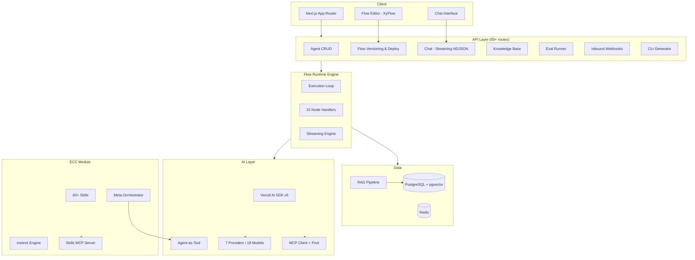

<p align="center">
  <h1 align="center">Agent Studio</h1>
  <p align="center">Visual AI agent builder with multi-agent orchestration and continuous learning.</p>
</p>

<p align="center">
  <a href="LICENSE"></a>
  
  
  
  
</p>

<p align="center">
  <a href="https://railway.app/new/template?template=https://github.com/webdevcom01-cell/agent-studio">
    
  </a>
  <a href="https://render.com/deploy?repo=https://github.com/webdevcom01-cell/agent-studio">
    
  </a>
</p>

<!-- TODO: Replace with actual screenshot of dashboard or flow editor -->
<p align="center">
  
</p>

---

## Quick Start

```bash
git clone https://github.com/your-org/agent-studio.git
cd agent-studio
cp .env.example .env
# Fill in DEEPSEEK_API_KEY and OPENAI_API_KEY, then:
docker compose up
```

Open [http://localhost:3000](http://localhost:3000) and create your first agent.

> **No Docker?** See [Manual Setup](#manual-setup) below.

---

## Features

- **Visual Flow Editor** — Drag-and-drop builder with 32 node types (AI, logic, integrations, webhooks) powered by XyFlow
- **Enterprise RAG Pipeline** — Ingest URLs, PDFs, DOCX; chunk with 5 strategies; hybrid search (semantic + BM25) with pgvector; LLM re-ranking
- **MCP + A2A Protocols** — Connect external tools via Model Context Protocol; agent-to-agent communication following Google A2A v0.3
- **ECC Developer Skills** — 60+ skill modules and 25 developer agent templates with autonomous meta-orchestration and continuous learning
- **CLI Generator** — 6-phase AI pipeline wraps any CLI as an MCP server (Python FastMCP or TypeScript MCP SDK)
- **Agent Evals** — 3-layer testing: deterministic assertions, semantic similarity, LLM-as-Judge with 12 assertion types and deploy-triggered runs
- **Agent Marketplace** — 137 templates across 12 categories with faceted search, discovery, and one-click import
- **Embeddable Chat Widget** — Drop-in widget for any website with streaming responses, customizable appearance, and mobile support

---

## Architecture



---

## Manual Setup

<details>
<summary>Setup without Docker</summary>

### Prerequisites

- Node.js 20+
- pnpm 9+
- PostgreSQL with pgvector extension

### Steps

```bash
# Install dependencies
pnpm install

# Configure environment
cp .env.example .env.local
# Required: DATABASE_URL, DIRECT_URL, DEEPSEEK_API_KEY, OPENAI_API_KEY,
#           AUTH_SECRET, AUTH_GITHUB_ID/SECRET or AUTH_GOOGLE_ID/SECRET

# Enable pgvector (run in your PostgreSQL client)
# CREATE EXTENSION IF NOT EXISTS vector;

# Setup database and generate client
pnpm db:push && pnpm db:generate

# Start dev server
pnpm dev
```

Open [http://localhost:3000](http://localhost:3000).

</details>

---

## Available Commands

```
pnpm dev              # Dev server (Turbopack)
pnpm build            # Production build
pnpm lint             # ESLint
pnpm typecheck        # TypeScript check
pnpm test             # Vitest unit tests (1500+)
pnpm test:e2e         # Playwright E2E tests
pnpm db:push          # Sync Prisma schema to DB
pnpm db:generate      # Generate Prisma client
pnpm db:studio        # Prisma Studio UI
```

---

## Tech Stack

| Layer | Technology |
|-------|-----------|
| Framework | Next.js 15.5, App Router, Turbopack |
| Runtime | React 19 |
| Language | TypeScript strict |
| Styling | Tailwind CSS v4 |
| Database | PostgreSQL + pgvector, Prisma v6 |
| AI | Vercel AI SDK v6 (7 providers, 18 models) |
| Auth | NextAuth v5 (GitHub + Google OAuth) |
| Flow Editor | @xyflow/react v12 |
| MCP | @ai-sdk/mcp (Streamable HTTP + SSE) |
| Validation | Zod v3 |
| UI | Radix UI + lucide-react |
| Tests | Vitest (unit) + Playwright (E2E) |

---

## Project Structure

```
prisma/schema.prisma        # 30+ models, pgvector, versioning, A2A, ECC
src/
  app/                      # Pages and 50+ API routes
    builder/[agentId]/      # Flow editor
    chat/[agentId]/         # Chat interface
    knowledge/[agentId]/    # Knowledge base
    evals/[agentId]/        # Agent evals
    discover/               # Agent marketplace
    skills/                 # ECC Skills Browser
    cli-generator/          # CLI-to-MCP pipeline
  components/               # React components
  lib/
    runtime/                # Flow engine (32 handlers)
    knowledge/              # RAG pipeline
    ecc/                    # ECC module
    evals/                  # Eval runner
    mcp/                    # MCP client + pool
  data/                     # Agent templates
services/ecc-skills-mcp/    # Python FastMCP server
e2e/                        # Playwright E2E tests
docs/                       # Documentation
```

---

## Documentation

| Document | Description |
|----------|------------|
| [Platform Overview](docs/01-overview.md) | Features and architecture |
| [Getting Started](docs/08-getting-started.md) | Setup guide |
| [Node Reference](docs/10-node-reference.md) | All 32 node types |
| [Knowledge Base Guide](docs/09-knowledge-base-guide.md) | RAG pipeline |
| [CLI Generator](docs/12-cli-generator.md) | MCP bridge generation |
| [Agent Evals](docs/13-agent-evals.md) | Testing framework |
| [CHANGELOG](CHANGELOG.md) | Version history |

<!-- TODO: Add link to hosted documentation site -->

---

## Contributing

Contributions are welcome. See [CONTRIBUTING.md](CONTRIBUTING.md) for guidelines.

<!-- TODO: Create CONTRIBUTING.md in Task 0.4 -->

---

## License

[Apache License 2.0](LICENSE)

```
Copyright 2026 Agent Studio Contributors
```
