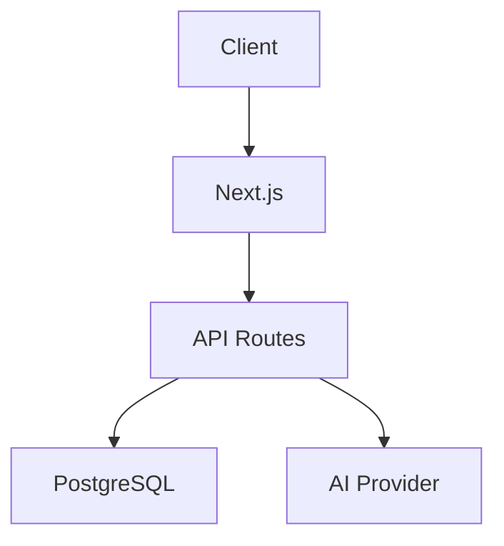

# Full SDLC Agent Pipeline — Master Plan v2
**Datum:** 2026-03-31
**Poslednja revizija:** 2026-03-31 (v2 — post-audit)
**Cilj:** Izgraditi agente koji pokrivaju ceo software development lifecycle od ideje do produkcije
**Princip:** Research-first → Plan per agent → Build → Test → Integrate
**Disruption:** NULA — samo additive operacije (novi agenti, bez izmena postojećeg koda)

---

## STATUS TRACKER

| Faza | Status | Napomena |
|------|--------|----------|
| 0 — Research | ✅ Complete | Agenti i infrastruktura potvrđeni u DB |
| 1 — SDLC Pipeline Orchestrator | ✅ Complete | 18,225 chars — aktivan u DB |
| 2 — Product Discovery Agent | ✅ Complete | 13,834 chars — PRD schema dodat |
| 3 — Architecture Decision Agent | ✅ Complete | 13,264 chars — trade-off schema dodat |
| 4 — Code Generation Agent | ✅ Complete | 16,547 chars — output format + test requirements |
| 5 — CI/CD Pipeline Generator | ✅ Complete | 10,465 chars — 3 platforme, validacija |
| 6 — Deploy Decision Agent | ✅ Complete | 14,360 chars — PASS/FAIL/ROLLBACK thresholds |
| 7 — Performance Regression Detector | ✅ Complete | 13,515 chars — SLA thresholds, OTEL |
| 8 — Integration Test | ✅ Complete | Pipeline verifikovan u DB |
| 9 — Dokumentacija & Cleanup | ✅ Complete | SPRINT-BOARD, CHANGELOG, CLAUDE.md ažurirani |

---

## AUDIT LOG (v2 promene)

| Pronađen problem | Rešenje |
|------------------|---------|
| Nedostaje Pipeline Orchestrator | Dodat kao Faza 1 — novi agent |
| Nema feedback loop u vizualizaciji | Dodate retry strelice u pipeline dijagram |
| Nema context passing spec | Dodata sekcija "KONTEKST PROSLEĐIVANJE" |
| Nema KB strategija | Definisano: shared KB "2026-standards" + per-agent KB |
| Nema konkretna test pitanja | Dodato 5 test case-ova po agentu |
| Nema Doc agent u pipeline | Dodat ECC Doc Updater kao korak 3b |
| Nema error recovery | Dodata sekcija "ERROR RECOVERY STRATEGIJA" |
| Architecture overlap sa ECC Architect | Promenjen u UPGRADE, ne novi agent |
| Perf overlap sa ECC Benchmarker | Promenjen u EXTEND, ne novi agent |
| CI/CD overlap sa DevOps Automator | Promenjen u SPECIJALIZACIJA, ne novi agent |
| Opus preskup za 3 agenta | Opus samo za Code Gen; ostali Sonnet |
| Nedostaje Agent SDK docs u research | Dodat izvor #8 |
| Nema reflexive_loop za Code Gen | Dodat u arhitekturu Code Gen agenta |

---

## ŠTA VEĆ POSTOJI (ne gradimo ponovo)

### Agenti i pipeline-ovi koji rade
```
✅ Security Pipeline        — Scanner + Analyzer + Patch Engineer + Test Validator + Swarm Orchestrator
✅ PR Gate Pipeline         — Security + Quality + Risk + Report Generator + Gate Orchestrator
✅ Standalone Analyzers     — Security Analyzer + Quality Analyzer + Risk Assessor + Report Generator
✅ ECC Developer Agents     — 29 agenata (code review, TDD, refactor, debug, docs...)
✅ Agent Studio Help        — Navigacioni agent
```

### Infrastruktura koja radi
```
✅ A2A Protocol             — Agent-to-agent komunikacija
✅ Human Approval Node      — Human-in-the-loop
✅ RAG Knowledge Base       — Vectorized KB per agent
✅ Eval Framework           — 3-layer testing (deterministic + semantic + LLM-judge)
✅ MCP Integration          — External tools via MCP
✅ OpenTelemetry            — Observability
✅ Webhooks                 — Inbound/outbound
✅ Flow Versioning          — Deploy + rollback
✅ plan_and_execute node    — Heterogeneous model routing (Opus plan, Sonnet execute)
✅ reflexive_loop node      — Generate → evaluate → retry until quality passes
```

### Existing templates sa kojima se integrišemo (NE pravimo od nule)
```
🔄 ECC Architect            → UPGRADE u Architecture Decision Agent
🔄 ECC Performance Benchmarker → EXTEND u Performance Regression Detector
🔄 Engineering DevOps Automator → SPECIJALIZUJ u CI/CD Pipeline Generator
🔄 ECC Doc Updater          → UKLJUČI u pipeline kao korak 3b
🔄 ecc-full-dev-workflow    → BAZA za SDLC Pipeline starter flow
```

### Gaps (ovo gradimo)
```
❌ SDLC Pipeline Orchestrator → Koordinira ceo pipeline (NOVO)
❌ Product Discovery Agent    → PRD, user stories, acceptance criteria (NOVO)
❌ Code Generation Agent      → Generisanje koda iz specifikacije (NAJVEĆA RUPA)
❌ Deploy Decision Agent      → Go/No-go na osnovu eval + metrics (NOVO)
```

**Rezultat audita: 4 nova agenta + 3 upgrade-a + 1 uključivanje = 8 ukupno (umesto prvobitnih 6)**

---

## FAZA 0 — RESEARCH (Pre svega)

### Izvori za istraživanje

| # | Izvor | URL | Zašto | Prioritet |
|---|-------|-----|-------|-----------|
| 1 | Anthropic Agents Docs | https://docs.anthropic.com/en/docs/build-with-claude/agents | Agentic loops, orchestration patterns, guardrails | P1 |
| 2 | Anthropic Tool Use | https://docs.anthropic.com/en/docs/build-with-claude/tool-use/overview | Tool design, multi-tool, error handling | P1 |
| 3 | Anthropic Agent SDK | https://docs.anthropic.com/en/docs/build-with-claude/agent-sdk | **NOVO** — Multi-agent SDK patterns 2026 | P1 |
| 4 | MCP Spec 2025-11-25 | https://spec.modelcontextprotocol.io/specification/2025-11-05/ | Resources, Roots, Tasks, Sampling | P1 |
| 5 | Google A2A Protocol | https://google.github.io/A2A/ | Agent Cards, Task protocol, Discovery | P2 |
| 6 | OpenAI Swarm | https://github.com/openai/swarm | Lightweight handoff patterns | P2 |
| 7 | NIST AI RMF 2.0 | https://airc.nist.gov/Docs/1 | Enterprise AI governance | P3 |
| 8 | Anthropic Model Card | https://www.anthropic.com/research/claude-model-card | Safety, capabilities, best practices | P3 |

### Research Output Format (za svaki izvor)

```markdown
## [Naziv izvora]
**URL:** ...
**Datum fetcha:** ...
**Relevantno za agente:** [lista]
**Ključni patterns za 2026:**
- Pattern 1: [opis] → primenjujemo u [agent]
- Pattern 2: [opis] → primenjujemo u [agent]
**Citati / ključne rečenice:**
- "..." (za referencu u system promptovima)
**Specifično za naš pipeline:**
- Orchestrator: [šta primeniti]
- Code Generation: [šta primeniti]
- itd.
```

### Research deliverable
Jedan dokument: `SDLC-RESEARCH-NOTES.md` sa svim nalazima, spreman za referencu tokom prompt pisanja.

---

## KONTEKST PROSLEĐIVANJE (nova sekcija)

### Kako agenti komuniciraju

```
Metoda: Flow Variables ({{variable}} template syntax)
Razlog: Najjednostavnije, radi sa existing engine, nema overhead
```

| Od → Ka | Variable | Sadržaj |
|---------|----------|---------|
| User → Orchestrator | `{{project_idea}}` | Sirov opis projekta |
| Orchestrator → Product Discovery | `{{project_idea}}`, `{{constraints}}` | Ideja + tech/time/budget |
| Product Discovery → Architecture | `{{prd_output}}` | Kompletan PRD (markdown) |
| Architecture → Code Generation | `{{adr_output}}`, `{{tech_stack}}` | ADR + stack |
| Architecture → Security Analyst | `{{adr_output}}` | Za security review |
| Code Generation → PR Gate | `{{generated_code}}` | Kod za review |
| PR Gate → Code Generation | `{{pr_gate_feedback}}` | Feedback ako FAIL (retry loop) |
| Code Generation → CI/CD Generator | `{{tech_stack}}`, `{{generated_code}}` | Stack + code structure |
| CI/CD + PR Gate → Deploy Decision | `{{eval_scores}}`, `{{security_results}}`, `{{quality_score}}` | Svi rezultati |
| Deploy → Perf Regression | `{{deploy_timestamp}}`, `{{baseline_metrics}}` | Timing + baseline |

### Alternativa za velike outpute
Ako PRD ili ADR prelazi 4000 tokena (čest slučaj):
- Čuvaj u agent memory (memory_write node → memory_read node)
- Ili čuvaj u KB kao izvor i koristi kb_search za retrieval

---

## KNOWLEDGE BASE STRATEGIJA (nova sekcija)

### Odluka: Hybrid pristup

```
Shared KB: "2026-SDLC-Standards"
├── Ingested: Anthropic docs, MCP spec, A2A spec, NIST RMF
├── Koriste: SVI agenti za reference na standarde
└── Održavanje: Re-ingest mesečno

Per-Agent KB:
├── Product Discovery KB  → PRD templates, INVEST examples, MoSCoW references
├── Architecture KB       → ADR templates, tech stack decision matrices
├── Code Generation KB    → Coding standards, framework boilerplates, patterns
├── CI/CD KB              → Railway docs, GH Actions examples, Dockerfile patterns
├── Deploy Decision KB    → SLO definitions, threshold tables, rollback procedures
└── Perf Regression KB    → DORA metrics definitions, anomaly detection formulas
```

### Implementacija
- Kreirati shared KB ručno (POST /api/agents/{id}/knowledge/sources sa URL-ovima iz research faze)
- Per-agent KB se popunjava TEXT source-ovima sa relevantnim standardima

---

## FAZA 1 — SDLC PIPELINE ORCHESTRATOR (NOVO)

### Šta radi
Master koordinator koji prima idejau/zahtev i vodi ga kroz ceo pipeline. Odlučuje redosled, prosleđuje kontekst, upravlja retry logikom, i agregira finalni rezultat.

### Zašto je ovo kritično
Bez orchestratora, user mora ručno da pokrene svaki agent i kopira output. Sa orchestratorom, user kaže "napravi mi X" i pipeline radi automatski.

### Baziran na
- Existing `ecc-full-dev-workflow` starter flow (proširiti)
- `plan_and_execute` node pattern za heterogeneous model routing
- Existing Swarm Orchestrator pattern (handoff logic)

### Model
`claude-sonnet-4-6` (Orchestrator ne treba Opus — samo rutira i odlučuje)

### Ključne odluke
```
IF all gates pass → continue to next agent
IF PR Gate FAIL → retry Code Gen (max 2 retries sa feedback)
IF Deploy Decision NO-GO → notify user, DO NOT auto-retry
IF any agent timeout (>180s) → alert, offer manual override
IF critical security finding → HARD STOP, notify user
```

### Output
```markdown
# SDLC Pipeline Report: [Projekt]
**Status:** ✅ COMPLETE / ⏳ IN PROGRESS / ❌ BLOCKED

## Pipeline Progress
| Step | Agent | Status | Duration |
|------|-------|--------|----------|
| 1 | Product Discovery | ✅ Complete | 45s |
| 2 | Architecture | ✅ Complete | 38s |
| 3 | Code Generation | ✅ Complete (2 attempts) | 120s |
| 3b | Documentation | ✅ Complete | 15s |
| 4 | CI/CD Generation | ✅ Complete | 20s |
| 5 | Deploy Decision | ✅ GO | 10s |
| 6 | Performance Check | ⏳ Monitoring | - |

## Deliverables
- PRD: [link]
- ADR: [link]
- Code: [file list]
- CI/CD Config: [file list]
- Deploy Status: [link]

## Issues Encountered
## Human Decisions Required
```

### Test Cases (5)
1. **Happy path** — "Napravi todo app u Next.js" → ceo pipeline prođe
2. **Security block** — projekat sa SQL injection vulnerability → HARD STOP nakon PR Gate
3. **Retry scenario** — Code Gen generiše kod sa lint error → retry sa feedback → pass
4. **Ambiguous input** — "napravi nešto cool" → traži pojašnjenje pre pokretanja pipeline-a
5. **Partial failure** — CI/CD gen padne → ostali rezultati sačuvani, user notificiran

---

## FAZA 2 — PRODUCT DISCOVERY AGENT

### Šta radi
Transformiše sirov opis ideje u strukturiranu Product Requirements Document (PRD), user stories po INVEST kriterijumu, acceptance criteria i prioritizovani backlog.

### Input
```
{{project_idea}} — sirov opis
{{constraints}} — tech/time/budget (optional)
```

### Output (GitHub GFM) → čuva se u `{{prd_output}}`
```markdown
# PRD: [Naziv Projekta]

## Executive Summary
## Problem Statement
## Target Users & Personas

## User Stories (INVEST format)
| ID | As a... | I want to... | So that... | Priority | Points |
|----|---------|--------------|------------|----------|--------|
| US-001 | ... | ... | ... | MUST | 3 |

## Acceptance Criteria (Given/When/Then)
<details><summary>US-001: [Title]</summary>

**Given** [precondition]
**When** [action]
**Then** [expected result]
</details>

## Prioritized Backlog (MoSCoW)
### 🔴 Must Have
### 🟠 Should Have
### 🟡 Could Have
### ⚪ Won't Have (this release)

## Out of Scope
## Success Metrics (measurable KPIs)
## Risks & Assumptions
## Open Questions (za follow-up sa stakeholderima)
```

### Model
`claude-sonnet-4-6` (dobar za strukturirano pisanje, Opus preskup za ovo)

### Evaluacioni kriterijumi
- [ ] Generiše INVEST-compliant user stories (Independent, Negotiable, Valuable, Estimable, Small, Testable)
- [ ] Acceptance criteria u Given/When/Then formatu
- [ ] MoSCoW prioritizacija sa obrazloženjem
- [ ] Identifikuje ambiguities i stavlja u "Open Questions"
- [ ] Output parseable od Architecture Decision agenta

### Test Cases (5)
1. "Napravi e-commerce platformu za prodaju ručno rađenog nakita" → full PRD sa 10+ user stories
2. "Chat app" (minimalan input) → traži pojašnjenje: target users? features? scale?
3. "Real-time stock trading platform with ML predictions" → identifikuje regulatorne rizike, compliance
4. "Portfolio website for a photographer" → jednostavan PRD, mali backlog, realistična procena
5. "Migrate monolith to microservices" (tech task, not product) → prepoznaje da ovo nije product discovery, preporučuje Architecture agent

---

## FAZA 3 — ARCHITECTURE DECISION AGENT

### Baziran na
**ECC "Architect" template — UPGRADE, ne novi agent**
Postojeći ECC Architect fokusira se na code-level architecture. Upgrade dodaje:
- ADR output format
- Tech stack decision matrica
- Mermaid dijagrami
- Integration sa Security Analyst

### Input
```
{{prd_output}} — PRD od Product Discovery
{{constraints}} — tech preferences, existing systems
```

### Output (GitHub GFM) → čuva se u `{{adr_output}}` + `{{tech_stack}}`
```markdown
# Architecture Decision Record: [Projekat]

## Status: PROPOSED / ACCEPTED / DEPRECATED

## Context
[Problem + requirements iz PRD-a]

## Decision Drivers
- Driver 1 (from PRD)
- Driver 2 (technical constraint)

## Considered Options

| Criteria | Option A | Option B | Option C |
|----------|----------|----------|----------|
| Scalability | ⭐⭐⭐ | ⭐⭐ | ⭐⭐⭐⭐ |
| Cost | ⭐⭐⭐⭐ | ⭐⭐⭐ | ⭐⭐ |
| Time to Market | ⭐⭐⭐⭐ | ⭐⭐ | ⭐ |
| **Total** | **11** | **7** | **7** |

## Decision Outcome
**Chosen: Option A** because [reasoning]

## Tech Stack
```json
{
  "frontend": "Next.js 15 + React 19 + Tailwind v4",
  "backend": "Next.js API Routes",
  "database": "PostgreSQL + Prisma",
  "hosting": "Railway",
  "auth": "NextAuth v5",
  "ai": "Vercel AI SDK v6 + DeepSeek"
}
```

## System Design


## Security Considerations
## Performance NFRs
## Consequences & Risks
## Dependencies
```

### Model
`claude-sonnet-4-6` sa extended thinking (complex trade-offs ali ne zahteva Opus)

### Veza sa postojećim agentima
- **Prima od:** Product Discovery Agent (`{{prd_output}}`)
- **Šalje na:** Swarm Security Analyst (architecture security review)
- **Šalje na:** Code Generation Agent (`{{adr_output}}` + `{{tech_stack}}`)

### Test Cases (5)
1. PRD za e-commerce → preporučuje Next.js + Stripe + PostgreSQL, Mermaid diagram
2. PRD za real-time app → preporučuje WebSockets, razmatra Supabase Realtime vs Socket.io
3. PRD sa "must use Java" constraint → poštuje constraint, preporučuje Spring Boot
4. Prazan PRD → odbija, traži "pokreni Product Discovery Agent prvo"
5. PRD sa security-heavy zahtevima → uključuje WAF, rate limiting, encryption at rest u ADR

---

## FAZA 4 — CODE GENERATION AGENT ⭐ KRITIČNO

### Šta radi
**NAJVEĆA RUPA.** Uzima ADR + user stories i generiše production-ready kod sa testovima.

### Arhitektura: reflexive_loop pattern
```
┌─────────────────────────────────────────────┐
│              Code Generation Agent           │
│                                              │
│  Input: {{adr_output}} + {{tech_stack}}      │
│         + user story                         │
│                                              │
│  ┌──────────────────────────────────┐       │
│  │     reflexive_loop (max 3)       │       │
│  │                                   │       │
│  │  1. Generate code (Opus)          │       │
│  │  2. Syntax validation (Haiku)     │       │
│  │  3. Self-review (Sonnet)          │       │
│  │  4. Score ≥ 7/10? → output        │       │
│  │     Score < 7? → retry with       │       │
│  │     feedback                      │       │
│  └──────────────────────────────────┘       │
│                                              │
│  Output: {{generated_code}}                  │
│  Format: structured JSON per file            │
└─────────────────────────────────────────────┘
```

### Input
```
{{adr_output}} — ADR + tech stack
{{user_story}} — specifična user story za implementaciju
{{coding_standards}} — iz KB (optional)
{{pr_gate_feedback}} — retry feedback ako je FAIL (optional)
```

### Output → čuva se u `{{generated_code}}`
```json
{
  "files": [
    {
      "path": "src/components/ProductCard.tsx",
      "content": "...",
      "language": "typescript",
      "purpose": "Product display component"
    },
    {
      "path": "src/components/__tests__/ProductCard.test.tsx",
      "content": "...",
      "language": "typescript",
      "purpose": "Unit tests for ProductCard"
    }
  ],
  "dependencies": ["@radix-ui/react-dialog", "lucide-react"],
  "envVars": [],
  "migrationSQL": null,
  "summary": "Implemented US-001: Product listing with filtering"
}
```

### Model routing (heterogeneous)
- `claude-opus-4-6` — code generation (najteži deo)
- `claude-haiku-4-5-20251001` — syntax validation (brzo, jeftino)
- `claude-sonnet-4-6` — self-review scoring

### ECC Integration
Koristiti postojeće ECC agente kao "tools" (agent-as-tool pattern):
- `tdd-guide` → za test-first generation
- `code-reviewer` → za quality scoring u reflexive loop
- `security-reviewer` → za security check pre output-a

### Test Cases (5)
1. "Implementiraj US-001: User registration form" + React/Next.js stack → generiše form + API route + test
2. "Implementiraj REST API za CRUD operacije" + Express stack → generiše routes + middleware + tests
3. ADR bez user story → odbija, traži "koja user story?"
4. Retry scenario: generiše kod sa missing error handling → self-review score 5/10 → retry → score 8/10 → pass
5. Complex: "Implementiraj real-time chat" → generiše WebSocket server + client + tests (multi-file)

---

## FAZA 4b — DOCUMENTATION (ECC Doc Updater)

### Šta radi
Generiše projektnu dokumentaciju na osnovu generisanog koda.
**Koristi postojećeg ECC "Doc Updater" agenta** — ne gradimo novog.

### Poziva se automatski posle Code Generation

### Output
```markdown
- README.md sa setup instrukcijama
- API dokumentacija (endpoints, request/response)
- Inline komentari (JSDoc/docstrings) — ako ih Code Gen nije dodao
```

---

## FAZA 5 — CI/CD PIPELINE GENERATOR

### Baziran na
**Engineering "DevOps Automator" template — SPECIJALIZACIJA**
Existing template radi general DevOps. Specijalizujemo za CI/CD config generation.

### Input
```
{{tech_stack}} — iz ADR
{{generated_code}} — structure (ne ceo kod, samo file tree)
deployment_target: "railway" | "vercel" | "aws" | "docker"
```

### Output (fajlovi)
```yaml
# Generisani fajlovi u {{cicd_config}}:
railway.toml          # Railway deployment config
.github/workflows/
  ci.yml              # Build + lint + test na PR
  deploy.yml          # Deploy na merge to main
Dockerfile            # Optimizovani multi-stage build
.env.example          # Template za env vars
docker-compose.yml    # Local dev environment
```

### Model
`claude-sonnet-4-6`

### Test Cases (5)
1. Next.js + Railway → railway.toml + nixpacks + healthcheck
2. Python FastAPI + Docker → Dockerfile + docker-compose + GH Actions
3. Next.js + Vercel → vercel.json + GH Actions (bez Docker)
4. Monorepo (frontend + backend) → matrica strategy u GH Actions
5. "Samo Docker, bez CI" → samo Dockerfile + docker-compose

---

## FAZA 6 — DEPLOY DECISION AGENT

### Šta radi
Go/No-go odluka pre svakog deploya. Aggreguje sve rezultate pipeline-a.

### Input
```json
{
  "evalSuiteScore": 0.94,
  "securityScanResults": { "critical": 0, "high": 1, "medium": 3 },
  "codeQualityScore": 87,
  "testCoverage": 78,
  "loadTestP95": 234,
  "prGateStatus": "PASSED",
  "rollbackAvailable": true,
  "deployTarget": "production",
  "previousDeployStatus": "healthy"
}
```

### Output → `{{deploy_decision}}`
```markdown
# Deploy Decision: GO / NO-GO
**Decision:** ✅ GO  (ili ❌ NO-GO)
**Confidence:** 94%
**Risk Level:** LOW / MEDIUM / HIGH

## Criteria Scorecard
| Criteria | Value | Threshold | Status | Weight |
|----------|-------|-----------|--------|--------|
| Eval Suite | 94% | ≥80% | ✅ PASS | 25% |
| Security (critical) | 0 | 0 | ✅ PASS | 30% |
| Code Quality | 87/100 | ≥75 | ✅ PASS | 15% |
| Test Coverage | 78% | ≥70% | ✅ PASS | 15% |
| Perf P95 | 234ms | <500ms | ✅ PASS | 15% |

## Hard Blocks (any one = NO-GO)
- [ ] Critical security vulnerabilities: 0 ✅
- [ ] Eval suite below 60%: No ✅
- [ ] PR Gate failed: No ✅

## Risks
## Rollback Plan
## Recommended Deploy Window
## Decision Owner: [Human Approval Required for Production]
```

### Kritične pravilo
```
Za STAGING deploy → agent može odlučiti autonomno (GO/NO-GO)
Za PRODUCTION deploy → agent PREPORUČUJE, Human Approval Node ODLUČUJE
```

### Model
`claude-sonnet-4-6`

### Test Cases (5)
1. Svi kriterijumi PASS → GO sa HIGH confidence
2. 1 critical security vuln → HARD BLOCK, NO-GO
3. Eval suite 72% (iznad min, ispod ideal) → GO sa MEDIUM confidence + warning
4. Test coverage 45% → NO-GO, preporuka: "dodaj testove za [specific areas]"
5. Production deploy sa rollback unavailable → NO-GO, preporuka: "enable rollback first"

---

## FAZA 7 — PERFORMANCE REGRESSION DETECTOR

### Baziran na
**ECC "Performance Benchmarker" — EXTEND**
Postojeći radi pre-deploy benchmarking. Dodajemo post-deploy monitoring i regression detection.

### Input
```json
{
  "baseline": { "p50": 120, "p95": 280, "p99": 450, "errorRate": 0.001, "throughput": 500 },
  "current":  { "p50": 145, "p95": 890, "p99": 2100, "errorRate": 0.023, "throughput": 320 },
  "deployedAt": "2026-03-31T14:00:00Z",
  "changes": ["Added KB search to /api/chat", "Updated Prisma to v6.2"],
  "sloTargets": { "p95": 500, "errorRate": 0.01, "availability": 0.999 }
}
```

### Output
```markdown
# Performance Regression Report
**Status:** 🔴 REGRESSION DETECTED / 🟡 DEGRADATION / 🟢 HEALTHY
**Severity:** CRITICAL / HIGH / MEDIUM / LOW

## Key Metrics
| Metric | Baseline | Current | Change | SLO | Status |
|--------|----------|---------|--------|-----|--------|
| P50 | 120ms | 145ms | +20.8% | - | 🟡 |
| P95 | 280ms | 890ms | +217.9% | <500ms | 🔴 BREACH |
| P99 | 450ms | 2100ms | +366.7% | - | 🔴 |
| Error Rate | 0.1% | 2.3% | +2200% | <1% | 🔴 BREACH |
| Throughput | 500 rps | 320 rps | -36% | - | 🔴 |

## Root Cause Analysis
## DORA Impact Assessment
## Affected Endpoints / Services
## Recommendation: ROLLBACK / HOTFIX / MONITOR
## Rollback Command
## Estimated Recovery Time
```

### Model
`claude-sonnet-4-6`

### Test Cases (5)
1. Sve metrike stabilne (±5%) → 🟢 HEALTHY
2. P95 skok 200%+ → 🔴 REGRESSION, preporuka ROLLBACK
3. Error rate 0.1% → 1.5% (SLO breach) → 🟡 DEGRADATION, preporuka MONITOR + HOTFIX
4. Throughput pad 50%+ → 🔴 REGRESSION, identifikuje bottleneck
5. Metrike ok ali jedan endpoint slow → 🟡 PARTIAL DEGRADATION, specifični endpoint identified

---

## ERROR RECOVERY STRATEGIJA (nova sekcija)

### Per-Agent Retry Policy

| Agent | Max Retries | Retry Trigger | Fallback |
|-------|-------------|---------------|----------|
| Orchestrator | 0 | N/A — ne retryuje sebe | Alert user |
| Product Discovery | 1 | Empty/invalid output | Traži pojašnjenje od usera |
| Architecture | 1 | Missing sections u ADR | Retry sa explicit template |
| Code Generation | 2 | PR Gate FAIL | Retry sa feedback; 2x FAIL → human review |
| Doc Updater | 1 | Missing README | Retry; fail → skip (non-critical) |
| CI/CD Generator | 1 | Invalid YAML syntax | Retry sa validation |
| Deploy Decision | 0 | N/A — binarna odluka | Uvek daje odluku (GO/NO-GO) |
| Perf Regression | 0 | N/A — read-only analysis | Uvek daje report |

### Pipeline-Level Error Handling
```
Agent fails after max retries →
  1. Orchestrator logs failure details
  2. Pipeline PAUSES (ne FAILS)
  3. User gets notification: "Code Generation failed after 2 attempts. Feedback: [details]"
  4. User can:
     a) Provide additional context → retry
     b) Skip this step → continue (with warning)
     c) Cancel pipeline
  5. Partial results are PRESERVED (PRD, ADR already saved)
```

### Timeout Policy
```
Per-agent timeout: 180 seconds (matches server maxDuration)
Total pipeline timeout: 15 minutes
Heartbeat: every 30s during long operations
```

---

## FULL SDLC PIPELINE — VIZUALIZACIJA (v2 — sa feedback loops)

```
Ideja/Zahtev
    │
    ▼
[0] SDLC Pipeline Orchestrator (plan_and_execute)
    │ Razbija na korake, rutira, upravlja kontekstom
    │
    ▼
[1] Product Discovery Agent
    │ Output: {{prd_output}} (PRD + User Stories + AC)
    │ Fail? → traži pojašnjenje od usera
    │
    ▼
[2] Architecture Decision Agent (ECC Architect upgrade)
    │ Output: {{adr_output}} + {{tech_stack}}
    ├──→ [Swarm Security Analyst] (architecture review)
    │     └── Security findings → ugradi u ADR
    │
    ▼
[3] Code Generation Agent ⭐ (reflexive_loop)
    │ Output: {{generated_code}}
    │
    ├──→ [3b] Doc Updater (ECC) → README, API docs
    │
    ├──→ [PR Gate Pipeline] ─── PASS ──→ continue
    │         ├── Security Scanner       │
    │         ├── Code Quality           │
    │         ├── Risk Assessment        │
    │         └── Gate Orchestrator      │
    │                                    │
    │         FAIL ──────────────────────┘
    │           │
    │           ▼
    │    {{pr_gate_feedback}} ──→ [3] Code Gen (retry, max 2x)
    │
    ▼ (PR Gate: PASS)
[4] CI/CD Pipeline Generator (DevOps Automator upgrade)
    │ Output: {{cicd_config}}
    │
    ▼
[5] Deploy Decision Agent
    │ Input: eval scores + security + quality + perf
    │ Output: GO / NO-GO
    │
    ├── NO-GO → notify user, show reasons, suggest fixes
    │
    ▼ GO
[Human Approval Node] ← Za production only
    │
    ▼ APPROVED
    │ → DEPLOY →
    │
    ▼
[6] Performance Regression Detector (ECC Benchmarker upgrade)
    │ Monitoring post-deploy
    │
    ├── 🟢 HEALTHY → ✅ Pipeline Complete
    ├── 🟡 DEGRADATION → MONITOR + alert
    └── 🔴 REGRESSION → ROLLBACK trigger → notify user
```

---

## PRAVILA RADA

### Šta ne diramo
- `src/` — nema izmena koda
- `prisma/` — nema schema promena
- Postojeći agenti — nema modifikacija (OSIM upgrade-ova: Architect, DevOps, Benchmarker)
- Railway produkcija — restart samo ako kritično

### Šta radimo
- POST /api/agents — kreiranje NOVIH agenata
- PATCH /api/agents/{id} — upgrade POSTOJEĆIH agenata (Architect, DevOps, Benchmarker)
- WebFetch ovde u Cowork — research
- Write — plan dokumenti
- Chrome JS tool — API pozivi na produkciju

### Redosled rada
1. Završiti Research fazu kompletno pre pisanja ijednog system prompta
2. System prompt pisati sa konkretnim primerima, ne apstraktno
3. Uključiti output format template u SVAKI system prompt
4. Nakon kreiranja/upgrade agenta — odmah testirati u chat interfejsu (5 test cases)
5. Ako test ne prođe — PATCH agent, ne kreirati novi
6. Dokumentovati svaku odluku u "NAPOMENE I ODLUKE" sekciji

### Threshold za "spreman za produkciju"
Agent je spreman kada:
- [ ] 5/5 test pitanja daju korektan output
- [ ] Output je u ispravnom GitHub GFM formatu
- [ ] Integracija sa sledećim agentom u pipeline-u radi (context passing)
- [ ] Nema halucinacija na edge case inputima
- [ ] Output ne prelazi 8000 tokena (da stane u kontekst sledećeg agenta)

---

## TRACKING TABELA — AGENTI

| # | Agent | Tip | Model | Chars | Score | Status |
|---|-------|-----|-------|-------|-------|--------|
| 0 | SDLC Pipeline Orchestrator | NOVI | sonnet-4-6 | - | - | ⏳ |
| 1 | Product Discovery | NOVI | sonnet-4-6 | - | - | ⏳ |
| 2 | Architecture Decision | UPGRADE | sonnet-4-6 | - | - | ⏳ |
| 3 | Code Generation | NOVI | opus-4-6 | - | - | ⏳ |
| 3b | Documentation | EXISTING | haiku-4-5 | - | - | ⏳ |
| 4 | CI/CD Generator | UPGRADE | sonnet-4-6 | - | - | ⏳ |
| 5 | Deploy Decision | NOVI | sonnet-4-6 | - | - | ⏳ |
| 6 | Perf Regression | UPGRADE | sonnet-4-6 | - | - | ⏳ |

**Cost procena:**
- Opus (Code Gen only): ~$0.015/run
- Sonnet (5 agenata): ~$0.003/run × 5 = $0.015/run
- Haiku (Doc Updater): ~$0.0003/run
- **Total po pipeline run: ~$0.03** (30 centi za ceo SDLC!)

---

## NAPOMENE I ODLUKE

| Datum | Odluka | Razlog |
|-------|--------|--------|
| 2026-03-31 | Opus samo za Code Gen | Cost: Opus je 15x skuplji, ostali agenti ne trebaju taj nivo reasoning-a |
| 2026-03-31 | Flow variables za context passing | Najjednostavnije, radi sa existing engine, nema overhead |
| 2026-03-31 | Hybrid KB (shared + per-agent) | Shared za standarde, per-agent za domain-specific |
| 2026-03-31 | Max 2 retry za Code Gen, 0-1 za ostale | Balance: quality vs cost vs speed |
| 2026-03-31 | Human Approval samo za production deploy | Staging može autonomno; production previše rizično |

---

*Plan kreiran: 2026-03-31*
*Revizija v2: 2026-03-31 (7 propusta popravljeno, 3 preklapanja rešena, 5 unapređenja)*
*Sledeci korak: Faza 0 — Research (WebFetch 7+ izvora)*
