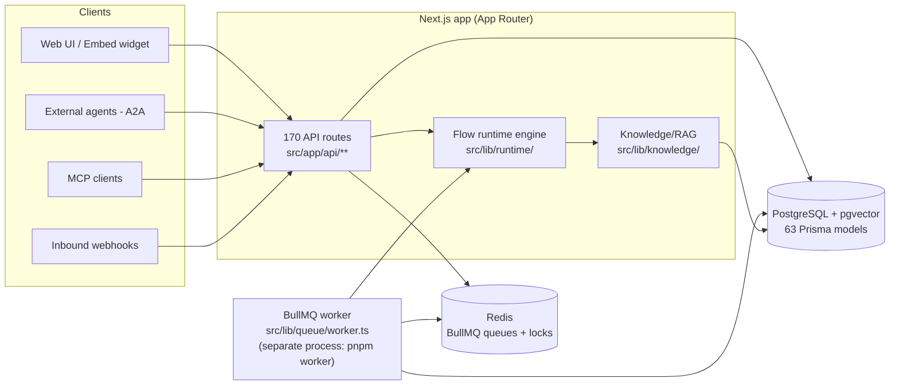

# System Architecture

> Diátaxis type: **explanation** — how Agent Studio is put together and why. Every claim below cites its source in the codebase. For raw facts (route lists, model lists), see the [reference section](../03-reference/api.md); for hands-on usage, see the [guides](../02-guides/flow-patterns.md).

## Bird's-eye view

Agent Studio is a **Next.js 15.5 monolith plus one background worker**, backed by PostgreSQL (with pgvector) and Redis:

The same codebase produces two deployables: the web app and the worker (`"worker": "tsx src/lib/queue/worker.ts"` in `package.json:29`; separate Railway service config in `worker.railway.toml`, `Dockerfile.worker`). Auxiliary services live in their own directories: `mcp-server/` (standalone MCP server exposing Agent Studio tools), `services/ecc-skills-mcp/`, `services/gh-bridge-mcp/`, `services/security-scanner-mcp/`, and `website/` (Docusaurus docs site). `deal-flow-agent/` is a separate Python FastAPI subproject (see `.claude/docs/deal-flow-agent.md`).

## Why a monolith with one worker

The app and worker share a single codebase and a single Prisma schema, so a flow executes identically whether it is triggered synchronously from chat or asynchronously from a queue job — both paths call the same runtime engine (`src/lib/runtime/engine.ts`, `engine-streaming.ts`). What differs is only *where* the call happens: interactive chat runs in the request handler (streaming NDJSON via a `ReadableStream`, `src/lib/runtime/engine-streaming.ts:36`), while long-running or scheduled work goes through BullMQ (`src/lib/queue/index.ts` — job types `flow.execute`, `eval.run`, `webhook.execute`, `webhook.retry`, `kb.ingest`, `managed.task.run`, `mcp.flow.run`, `pipeline.run`) and is picked up by the worker process. Priorities are explicit numbers per job class (`PRIORITY_MAP`, `src/lib/queue/index.ts:153`), so interactive chat is never starved by batch work.

## The flow runtime

An agent's behavior is a **flow**: a JSON graph of typed nodes stored in the `Flow` model and versioned via `FlowVersion`/`FlowDeployment` (`prisma/schema.prisma`). The engine walks the graph node by node:

- **Source of truth for node types** is the `NodeType` union — 66 types (`src/types/index.ts:32`).
- Each type has a **handler** registered in `src/lib/runtime/handlers/index.ts`. The registry has 67 keys: the 66 public types plus an internal `code_review` handler used by the SDLC pipeline (`src/lib/runtime/handlers/index.ts:136`).
- **Handlers never throw.** Every handler returns an `ExecutionResult` and catches its own errors, degrading to an error message plus a safe next step (rule codified in `.claude/rules/node-handlers.md`). The engine therefore doesn't need per-node try/catch and a single broken node cannot crash a conversation.
- **Hard safety limits** bound every execution: `MAX_ITERATIONS = 50` (`src/lib/runtime/engine.ts:161`) and history compaction/truncation via `MAX_HISTORY` (`src/lib/runtime/context-compaction.ts`, imported at `engine.ts:4`). Loops must use the dedicated `loop` node rather than handler-internal looping.

The trade-off is deliberate: graceful degradation over fail-fast. A chatbot that answers "an error occurred in this node" is more useful than a 500, and the limits guarantee termination even for cyclic graphs.

## AI provider access

All model calls go through the Vercel AI SDK — never raw provider fetches (`AGENTS.md`, enforced convention). `getModel(modelId)` in `src/lib/ai.ts` routes by model-id prefix; the client-safe catalog of 20 models across 8 providers lives in `src/lib/models.ts`. Embeddings are pinned to OpenAI `text-embedding-3-small` (1536 dims, `src/lib/ai.ts:117`), which is why `OPENAI_API_KEY` is required even when chat uses another provider.

## Knowledge / RAG design

Ingestion: source (URL/text/file) → chunking (recursive strategy, 512-token default with 100-token overlap, `src/lib/knowledge/chunker.ts:20`) → embedding → pgvector storage with HNSW indexes.

Retrieval is **hybrid on purpose**: semantic cosine similarity and BM25 keyword search are fused with Reciprocal Rank Fusion (`src/lib/knowledge/search.ts:299-340`). The semantic weight defaults to 0.7 and rises to 0.8 when contextual enrichment is enabled (`search.ts:563`); it is per-KB configurable via `hybridAlpha` (`src/lib/schemas/kb-config.ts:61`). Semantic search alone misses exact identifiers and proper nouns; keyword search alone misses paraphrase — the fusion covers both failure modes. Quality guards: a 0.25 relevance floor (`search.ts:18` — below it the agent gets *empty* context rather than noise), dynamic top-K scaled to query length (`computeDynamicTopK`, `search.ts:415`), neighbor-chunk expansion, and a 4 000-token context budget (`search.ts:70`).

## Multi-tenancy and security

Tenancy is organization-based (`Organization`, `OrganizationMember`, `Invitation` models). Two layers enforce isolation:

1. **Application layer** — auth guards (`requireAuth` / `requireAgentOwner` from `src/lib/api/auth-guard.ts`; raw `auth()` calls are banned by `.claude/rules/api-routes.md`). Public surface is a small allow-list in `src/middleware.ts` (health, embed widget, A2A agent-card, auth).
2. **Database layer** — PostgreSQL Row-Level Security. `withOrgContext(prisma, orgId, fn)` wraps queries in a transaction and sets the `app.current_org_id` session variable inside it (`src/lib/db/rls-middleware.ts:52-77`); RLS policies filter every tenant table against `current_org_id()`. Enforcement is behind the `RLS_ENFORCEMENT_ENABLED` flag, evaluated at call time so production can flip it without a redeploy (`.env.example`, `src/lib/feature-flags/index.ts`).

Two governance systems intentionally **fail open**: budget checks (`checkBudget` returns `allowed: true` when no budget row exists, `src/lib/budget/cost-tracker.ts:28`) and approval policies (`checkPolicies` — policy error → allow, documented in `CLAUDE.md` §5). The reasoning: a broken metering or policy subsystem should degrade to "agents keep working" rather than take the whole product down. The inverse choice — fail closed — is reserved for isolation (RLS) and auth, where availability must not trump correctness.

## Interop surfaces

- **MCP (Model Context Protocol)** — in both directions. Agents *consume* external MCP tools through the `mcp_tool` node (`src/lib/mcp/client.ts`), and Agent Studio *is itself* an MCP server (`mcp-server/` — API-key USER mode and shared-secret ADMIN mode, `mcp-server/src/auth.ts`), so external LLM clients can trigger and manage agents.
- **A2A (Agent-to-Agent protocol)** — external agents discover Agent Studio agents via public agent cards (`src/app/api/a2a/[agentId]/agent-card`, allow-listed in `src/middleware.ts:43`). Internal agent-to-agent calls go through the `call_agent` node with permission checks against the org chart (`src/lib/org-chart/hierarchy.ts`).
- **Inbound webhooks** — Standard Webhooks with HMAC-SHA256 signatures; execution is queued (`webhook.execute` job) rather than run in the request path.

## Deployment shape

Production runs on Railway: the web app (healthcheck `/api/health`, 120 s timeout, `railway.toml:7-9`), the worker as a second service (`worker.railway.toml`), PostgreSQL at `postgres.railway.internal`, and Redis. Schema changes go exclusively through `pnpm prisma migrate deploy` — `prisma db push` against production is forbidden (`CLAUDE.md` §6, `AGENTS.md`). The RLS rollout runbook and status history live in `docs/_archive/rls-phase-1-cutover-runbook.md` and `CLAUDE.md` §5.

## Key decisions at a glance

| Decision | Choice | Why | Where |
|----------|--------|-----|-------|
| Execution model | Same engine for sync chat and async jobs | One semantics, two entry points | `src/lib/runtime/`, `src/lib/queue/` |
| Handler errors | Never throw, always degrade | Conversation survives a broken node | `.claude/rules/node-handlers.md` |
| Termination | Hard iteration/history caps | Cyclic graphs cannot hang | `engine.ts:161`, `context-compaction.ts` |
| Retrieval | Hybrid semantic+BM25 with RRF | Covers both paraphrase and exact-match failure modes | `src/lib/knowledge/search.ts` |
| Empty vs noisy context | 0.25 relevance floor, empty allowed | Irrelevant context is worse than none | `search.ts:18` |
| Tenancy | App guards **and** DB-level RLS | Defense in depth; DB backstops app bugs | `src/lib/db/rls-middleware.ts` |
| Budget/policy checks | Fail open | Metering outage must not stop agents | `cost-tracker.ts:28`, `CLAUDE.md` §5 |
| Provider access | Vercel AI SDK only | One switch point for 8 providers | `src/lib/ai.ts`, `src/lib/models.ts` |
| Schema changes | Migrations only, never `db push` | Auditable, reversible production DB | `CLAUDE.md` §6 |
