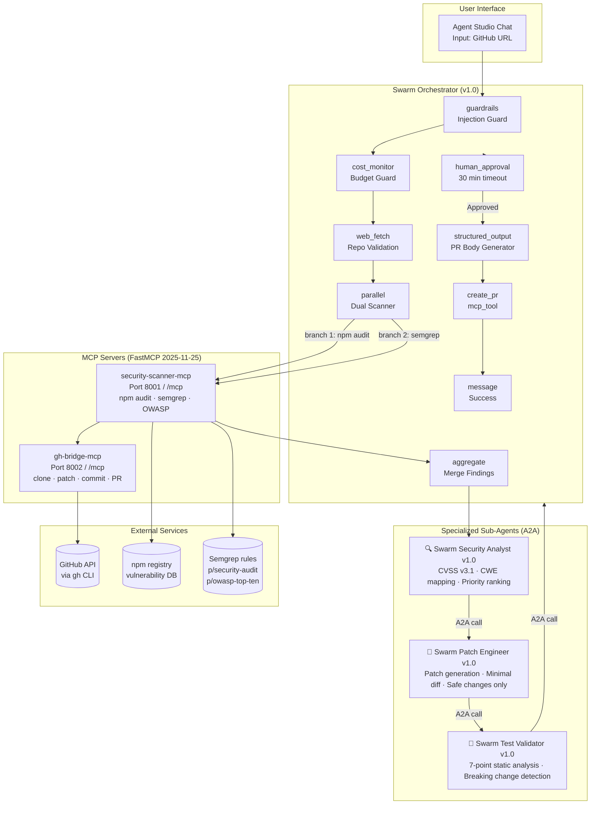

# Autonomous DevOps Swarm — Architecture

> **Version:** 1.0.0 | **Status:** Production-Ready | **Last Updated:** 2026-03-30

---

## Overview

The Autonomous DevOps Swarm is a multi-agent AI system built on Agent Studio's A2A (Agent-to-Agent) orchestration protocol. It autonomously discovers security vulnerabilities in GitHub repositories, generates patches, validates them, and creates pull requests — with a mandatory human approval gate before any code is pushed.

---

## System Architecture



---

## Agent Roles & Responsibilities

### 1. Swarm Orchestrator
**Model:** `claude-sonnet-4-6` (balanced tier)

The coordinating agent that manages the full pipeline. It does NOT directly call MCP tools for scanning — it delegates to specialist agents via A2A. Its responsibilities:

- Accept GitHub URL input with injection guard validation
- Enforce budget limits via `cost_monitor` (adaptive mode)
- Validate repository accessibility via `web_fetch`
- Launch parallel security scans
- Coordinate A2A calls to specialist agents
- Gate PR creation behind `human_approval`
- Report final status

**Flow:** 18 nodes · 26 edges · MAX_ITERATIONS=50

---

### 2. Swarm Security Analyst
**Model:** `claude-opus-4-6` (powerful tier — complex reasoning required)

Receives raw scanner output and transforms it into actionable intelligence. Responsibilities:

- Parse and de-duplicate findings from npm audit + semgrep
- Assign CVSS v3.1 scores to each finding
- Map findings to CWE identifiers
- Rank by severity: CRITICAL → HIGH → MEDIUM
- Cap output to top 10 prioritized findings
- Output strict JSON conforming to `SecurityAnalysisReport` schema

**Output Contract:**
```json
{
  "summary": "3 CRITICAL, 2 HIGH vulnerabilities found",
  "total_findings": 5,
  "scan_coverage": "npm-audit + semgrep",
  "findings": [
    {
      "id": "FINDING-001",
      "type": "dependency|code",
      "severity": "CRITICAL",
      "cvss_score": 9.8,
      "cwe_id": "CWE-89",
      "title": "SQL Injection in auth.ts:42",
      "description": "...",
      "location": "src/auth.ts:42",
      "package": null,
      "current_version": null,
      "fixed_version": null,
      "fix_available": true,
      "fix_priority": 1,
      "remediation_hint": "Use parameterized queries"
    }
  ],
  "recommended_actions": ["...", "..."],
  "compliance_notes": "EU AI Act Article 9 risk classification: HIGH"
}
```

---

### 3. Swarm Patch Engineer
**Model:** `claude-sonnet-4-6` (balanced tier)

Receives the Security Analyst's report and generates patches. Strict constraints:

- Only patches findings with `severity: CRITICAL | HIGH` and `fix_available: true`
- Reads actual source files via `gh-bridge-mcp` before patching
- Generates minimal unified diffs — changes only the vulnerable lines
- Never modifies test files, CI configs, or dependency lock files
- Creates a dedicated branch: `security/swarm-fix-{timestamp}`

**Output Contract:**
```json
{
  "branch_name": "security/swarm-fix-1711234567",
  "patches_applied": 3,
  "skipped_findings": 1,
  "patches": [
    {
      "finding_id": "FINDING-001",
      "file_path": "src/auth.ts",
      "original_snippet": "...",
      "patched_snippet": "...",
      "explanation": "Replaced string interpolation with parameterized query"
    }
  ],
  "dependency_updates": [
    {
      "package": "lodash",
      "from": "4.17.20",
      "to": "4.17.21"
    }
  ]
}
```

---

### 4. Swarm Test Validator
**Model:** `claude-haiku-4-5` (fast tier — deterministic static analysis)

Performs 7-point static validation of patches before any code is committed:

| Check | Description |
|-------|-------------|
| ✅ Syntax validity | Patch applies cleanly, no merge conflicts |
| ✅ Type safety | No TypeScript `any` introductions, no type removals |
| ✅ No breaking changes | Public API signatures preserved |
| ✅ Vulnerability confirmation | Original vulnerability pattern is no longer present |
| ✅ No new vulnerabilities | Patch doesn't introduce new CWE patterns |
| ✅ Test compatibility | Existing test assertions still structurally valid |
| ✅ Dependency integrity | Updated versions exist in npm registry |

**Output Contract:**
```json
{
  "validation_passed": true,
  "checks_run": 7,
  "checks_passed": 7,
  "checks_failed": 0,
  "confidence": 0.95,
  "results": [
    {
      "check": "syntax_validity",
      "passed": true,
      "details": "All patches apply cleanly"
    }
  ],
  "recommendation": "APPROVE | REVISE | REJECT",
  "rejection_reasons": []
}
```

---

## MCP Server Architecture

### security-scanner-mcp (Port 8001)

Built with Python FastMCP (MCP 2025-11-25 spec, Streamable HTTP transport).

| Tool | Description | Output Limit |
|------|-------------|--------------|
| `audit_dependencies` | Runs `npm audit --json`, parses to top 50 findings | 9,000 chars |
| `scan_code` | Runs `semgrep --config p/security-audit,p/owasp-top-ten` | 9,000 chars |
| `get_finding_detail` | Detailed info on a specific finding | 5,000 chars |
| `generate_fix_template` | Fix template for a given finding type | 3,000 chars |

**Design Decision:** All tools pre-parse output to respect MCP's 10K character-per-call limit. Raw `npm audit` JSON can be 50KB+ on real projects.

### gh-bridge-mcp (Port 8002)

GitHub operations bridge using `gh` CLI.

| Tool | Description |
|------|-------------|
| `validate_repo` | Check if repo is accessible and public |
| `clone_repo` | Shallow clone (depth=1) to `/tmp/devops-swarm/{repo}` |
| `list_files` | List files matching a glob pattern |
| `read_file` | Read file content (max 50KB) |
| `create_branch` | Create a new branch from default branch |
| `commit_patches` | Apply patches and commit with structured message |
| `push_branch` | Push branch to remote |
| `create_pr` | Create PR with title, body, and optional draft flag |
| `get_package_info` | Read package.json metadata |

**Authentication:** Requires `GITHUB_TOKEN` environment variable. Uses `GH_TOKEN` + `GITHUB_TOKEN` injection for `gh` CLI compatibility.

---

## Data Flow

```
GitHub URL
    │
    ▼
[guardrails] ──── SSRF check, URL format validation
    │
    ▼
[cost_monitor] ── Budget enforcement ($5 default limit)
    │
    ▼
[web_fetch] ───── HTTP HEAD to validate repo accessibility
    │
    ├─[condition: accessible?]──► End (repo not found)
    │
    ▼
[parallel] ──────────────────────────────────────────────
    ├── [mcp_tool: audit_dependencies] ─► npm findings JSON
    └── [mcp_tool: scan_code] ──────────► semgrep findings JSON
    │
    ▼
[aggregate] ─────── Merge both finding sets
    │
    ├─[condition: findings > 0?]──► End (no vulnerabilities)
    │
    ▼
[call_agent: Security Analyst] ── A2A · CVSS · CWE · priority rank
    │
    ▼
[call_agent: Patch Engineer] ──── A2A · reads files · generates diffs
    │
    ▼
[call_agent: Test Validator] ──── A2A · 7-point static analysis
    │
    ├─[condition: tests passed?]──► [retry] (max 1 retry)
    │
    ▼
[mcp_tool: create_branch] ─────── Creates security/swarm-fix-{ts} branch
    │
    ▼
[mcp_tool: commit_patches] ─────── Applies and commits all patches
    │
    ▼
[mcp_tool: push_branch] ─────────── Pushes to GitHub
    │
    ▼
[structured_output] ─────────────── Generates PR body markdown
    │
    ▼
[human_approval] ────────────────── ⚠️ MANDATORY GATE (30 min timeout)
    │
    ├─[Rejected]──► End (PR cancelled)
    │
    ▼
[mcp_tool: create_pr] ───────────── Creates GitHub PR
    │
    ▼
[message] ───────────────────────── Success report
```

---

## Security & Compliance

### Human-in-the-Loop (HITL)
The `human_approval` node is **mandatory and cannot be bypassed**. No code is pushed to GitHub without explicit human approval. This is both a safety measure and a compliance requirement under:
- **EU AI Act (2024/1689)** — Article 9: High-risk AI systems must have human oversight
- **NIST AI RMF 1.0** — Govern, Map, Measure, Manage framework for AI risk

### Audit Logging
All agent decisions are logged via `AuditLog` model:
- Agent calls with inputs/outputs
- Human approval decisions (with timestamp and approver)
- PR creation events

### SSRF Protection
The `guardrails` node validates GitHub URLs using `url-validation.ts`:
- Blocks private IP ranges (RFC 1918)
- Only allows `github.com` and `gitlab.com` hostnames
- Validates URL format before any network calls

### Rate Limiting
- A2A calls: 60 calls/min per agent pair (circuit breaker after 3 failures)
- GitHub API: `gh` CLI respects GitHub's rate limits (5000 req/hr authenticated)
- MCP tools: Connection pool with 5-min TTL and health checking

### Secrets Management
- `GITHUB_TOKEN` stored as Railway environment variable (never in code)
- No secrets are logged or included in PR bodies
- `config.ts` in the vulnerable demo uses **intentionally hardcoded** fake secrets for testing only

---

## Performance Characteristics

| Operation | Expected Duration | Notes |
|-----------|------------------|-------|
| Repo validation | 1-3s | HTTP HEAD only |
| npm audit | 10-30s | Depends on dependency count |
| semgrep scan | 15-60s | Depends on codebase size |
| Security analysis | 20-40s | Opus model, complex reasoning |
| Patch generation | 30-60s | Reads source files first |
| Test validation | 5-15s | Haiku model, fast |
| Total (no retry) | ~2-3 min | End-to-end, excluding human approval |

**Budget Estimate:** $0.30-0.80 per full pipeline run on a medium-sized repository.

---

## Infrastructure

```
Railway Project
├── agent-studio (Next.js, 2 replicas)
│   ├── security-scanner-mcp linked (Port 8001)
│   └── gh-bridge-mcp linked (Port 8002)
├── security-scanner-mcp (Python FastMCP, Port 8001)
│   ├── Python 3.12
│   ├── Node.js + npm (for audit)
│   └── semgrep
├── gh-bridge-mcp (Python FastMCP, Port 8002)
│   ├── Python 3.12
│   ├── git
│   └── gh CLI (GitHub CLI)
├── PostgreSQL + pgvector (shared)
└── Redis (cross-replica state)
```

---

## Known Limitations

1. **Private repositories** — Requires GITHUB_TOKEN with appropriate repo permissions
2. **Large codebases** — semgrep scan limited to 9000 chars output; very large repos may miss some findings
3. **Test execution** — The validator performs static analysis only; actual test suite is not run (sandbox limitation)
4. **Language support** — npm audit requires Node.js project; semgrep supports TypeScript/JavaScript/Python/Go
5. **Max 10 findings** — Security Analyst caps output to top 10 prioritized findings per run
6. **Single retry** — If test validation fails, one retry attempt is made; subsequent failures end the flow

---

## Related Documentation

- [SETUP.md](./SETUP.md) — Step-by-step deployment guide
- [Node Reference](../10-node-reference.md) — All 55 node types
- [DevSecOps Guide](../../src/app/devsecops/) — Full DevSecOps pipeline reference
- [ECC Security Templates](../../src/data/ecc-agent-templates.json) — Base security agent templates
